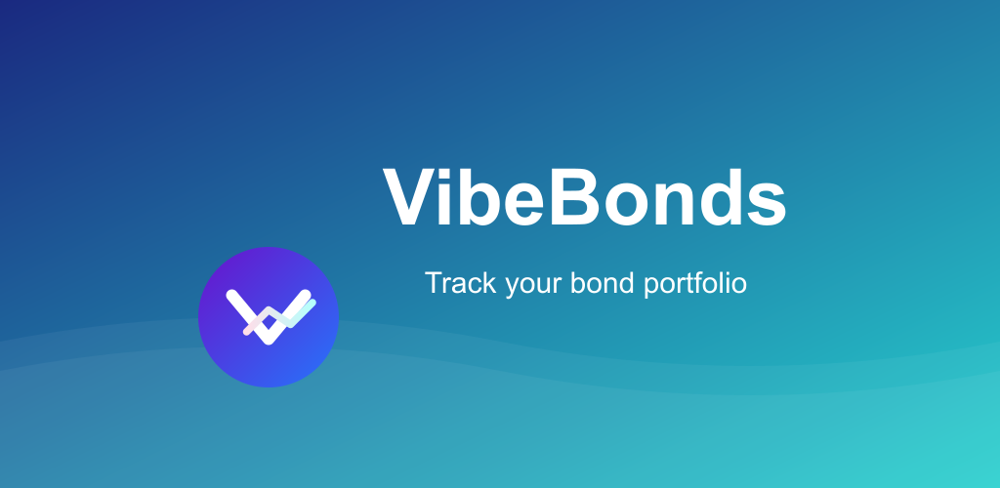

# Vibe Bonds Portfolio Mobile App

## Download

Get the app on Google Play:

## Overview
The Vibe Bonds Portfolio App is a mobile application designed to help users manage their bond investments efficiently. This app aims to provide tools for tracking bond portfolios and making informed investment decisions.

## Features
- **Portfolio Management**: Add, edit, and track your bond investments.

## Getting Started
### Prerequisites
- Android 5.0 or higher

### Installation
1. Clone this repository to your local machine.
2. Open the project in Android Studio.
3. Build and run the app on an emulator or physical device.

## Usage
After installation, log in with your credentials, or register a new account. Navigate through the app to access different sections like Dashboard and Portfolio.

## Project Documentation
- [Product Requirements Document (PRD)](./BondPortfolioApp_PRD.md)
- [TODO List](./BondPortfolioApp_TODO.md)

## Contributing
Contributions are welcome! Please feel free to submit a Pull Request.

## License
This project is licensed under the MIT License - see the LICENSE file for details.

## Contact
For support or queries, reach out to us at admin@ryzoft.com.
